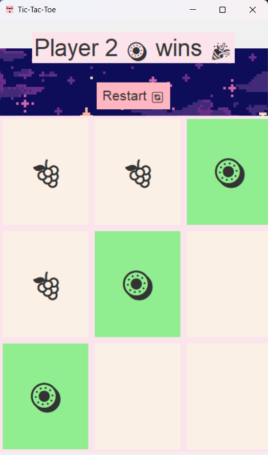

# 🍓 Fruit Frenzy Tic Tac Toe 🍇

Tic Tac Toe with juicy emojis, fruity players, sound effects, and pixel-perfect UI.

## 🎮 Features

- 🍓 Random fruity emoji player pairs every game
- 🔊 Fun sound effects for clicks, wins, and ties (requires speakers!)
- 💡 Blinking winner tiles animation
- 🎨 Retro pixel-art background
- 🔁 One-click restart button

## 🌟 Screenshots



## 🖥️ Tech Stack

- Python 🐍
- Tkinter (GUI)
- Pygame (for sound)

## 🚀 How to Run

### 1️⃣ Clone the Repository

```bash
git clone https://github.com/Jayavarshini-Jayakumaran/fruit-frenzy-tic-tac-toe.git
cd fruit-frenzy-tic-tac-toe
```

### 2️⃣ Install the Dependencies

```bash
pip install -r requirements.txt
```

### 3️⃣ Run the Game

```bash
python src/main.py
```

---
📧 **Email** — [jayavarshinijayakumaran11@gmail.com](mailto:jayavarshinijayakumaran11@gmail.com)

🙌 **Connect** — [LinkedIn: Jayavarshini Jayakumaran](https://www.linkedin.com/in/jayavarshini-jayakumaran)

📄 **License** — [MIT](LICENSE)

<p align="center"><b>Finish what you started 💻</b></p>
